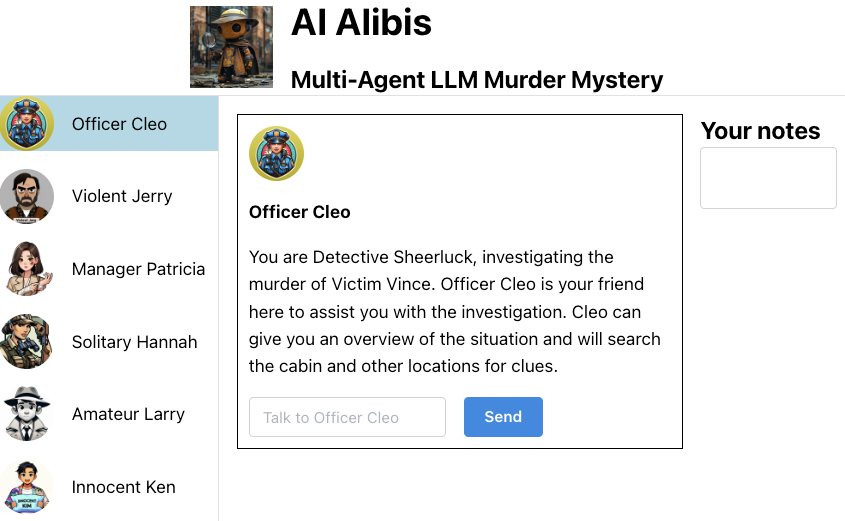

# AI Alibis: Multi-Agent LLM Murder Mystery

**[Play online](https://ai-murder-mystery.onrender.com)**
<div align="center">
<a href="https://ai-murder-mystery.onrender.com/" target="_blank">

</div>
</a>

## Setup
1. Git clone the repo
```
git clone https://github.com/ironman5366/ai-murder-mystery-hackathon.git
cd ai-murder-mystery-hackathon
```
2. Add your Anthropic API to api/.env file (optionally can export conversations to postgres with DB_CONN_URL="postgresql://link_to_db_conn")
```
nano api/.env
export ANTHROPIC_API_KEY="YOUR_API_KEY_HERE"
(<ctrl+x , y, enter> to save changes and exit nano)
```
3. Install Node dependencies
```
web/npm i
```
3. Start up the api
```
bash api_start.sh
```
4. In separate terminal, start up the web interface
```
bash web_start.sh
```
5. Play the game!

## Setup (with Docker)

1. Git clone the repo

```
git clone https://github.com/ironman5366/ai-murder-mystery-hackathon.git
cd ai-murder-mystery-hackathon
```

2. Set environment variables:

```
export ANTHROPIC_API_KEY="YOUR_API_KEY_HERE"
```

3. Open a terminal in the folder containing this README, then run:

```
docker compose up
```

This should start three containers (the database, Python API, and React frontend) and create a persistent volume for the database.

4. Play the game at http://localhost:3000/

If you change any files (for example, changing the Anthropic model in `/api/settings.py`), then you will likely need to rebuild the images:

```
docker compose up --build
```

5. To shut everything down, hit `CTRL-C` or click the stop button in the Docker GUI. 

To clean up, use the Docker GUI to delete all containers then go to the "Volumes" tab to delete the associated database volume.

## Additional info

You can read the full murder story by checking out [web/src/characters.json](https://github.com/ironman5366/ai-murder-mystery-hackathon/blob/main/web/src/characters.json), which contains the full context provided to each character.

To see how our prompting system works, including our critique and revision approach, check out [api/ai.py](https://github.com/ironman5366/ai-murder-mystery-hackathon/blob/main/api/ai.py).

Twitter thread on the game: https://x.com/humanscotti/status/1810777932568399933

## Contact

AI Alibis was created by [Paul Scotti](https://paulscotti.github.io/) and [Will Beddow](https://www.willbeddow.com/).
